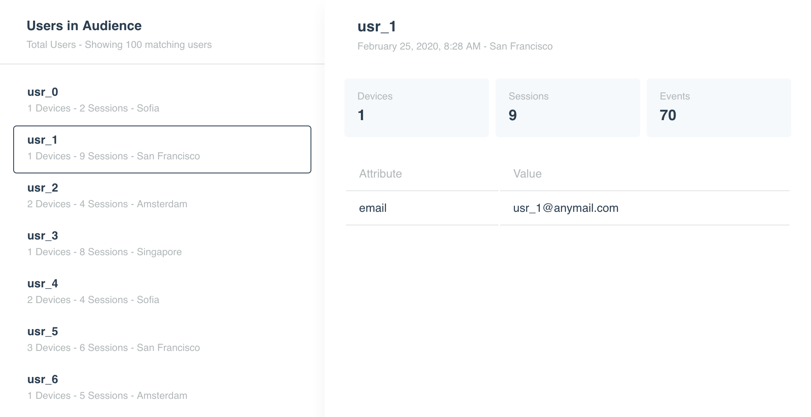
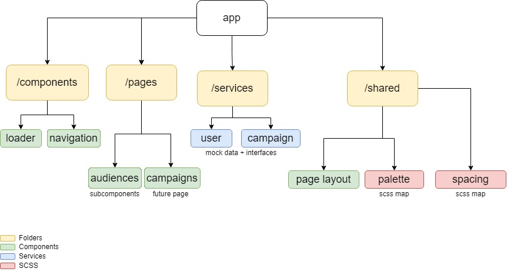

# Leanplum Task by Martin Antonov

##Project deliverables
1. Live preview deployed on Firebase here: https://leanplum-task.web.app/audiences
2. To see a result very close to the provided image, feel free to zoom in to ~150-175%
3. To run locally - after cloning the project, type `npm install` and `ng serve` in the terminal. The web task should be running on  http://localhost:4200/

## Task
Implement the following layout with data, provided in the zip.  

## Implementation Overview
The task is implemented with Angular. Some further notes below:

### Visual Notes
* The data is transformed a little, to conform to the Angular standards of writing - there is an interface, along with a mock-data function.
* The data is converted to observable with 1s delay before "receiving" it, to mock a real http call.
* A loading bar is displayed while the data is being "received".
* Scrollbars have been added.
* Light animations on hover have been added.
* Nav menu for the campaigns, which I have found in the vue template. I presume this will be implemented in the future.
* Favicon and page title have been changed. 

### Architectural decisions

* The application is split into a few folders (src/app/...) 
  * _/components_ - this is where generic components, not directly linked to a specific page would live. In this case the loading animation and nav bar
  * _/pages_ - There are two pages - audiences and campaigns. All page specific components are nested within these folders
  * _/services_ - where services for the specific pages are. There are interfaces and mock-data for each interface. 
  * _shared_ - a set of global/util components, scss and, in the future, services. 
* The colours are defined in a palette scss map to be easily extensible in the future. Same applies for the margins/paddings/
* There is a generic component - page-layout (inside _/shared_), which defines the page layout slots - header, content and left-nav (for the list). My presumption is that other pages will have a similar layout, so with Angular's content projection there is no need to write almost any css in the pages' components.
